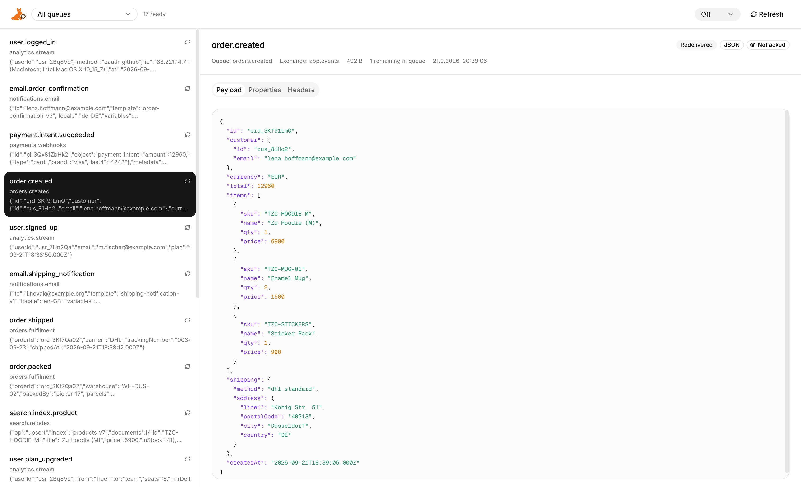

<p align="center">
  
</p>

<h1 align="center">RabbitLens</h1>

<p align="center">
  <strong>A modern open source RabbitMQ queue browser and message viewer built for debugging.</strong>
</p>

<p align="center">
  Inspect messages across multiple RabbitMQ queues without consuming them.
  Browse payloads, headers and properties in a fast, clean web interface.
</p>

<p align="center">
  <a href="https://github.com/withzu/rabbitlens/releases">Releases</a>
  ·
  <a href="#quick-start">Quick Start</a>
  ·
  <a href="https://github.com/withzu/rabbitlens/issues">Issues</a>
</p>

<p align="center">
  <a href="https://github.com/withzu/rabbitlens/releases">
    
  </a>
  <a href="https://github.com/withzu/rabbitlens/stargazers">
    
  </a>
  <a href="LICENSE">
    
  </a>
</p>

<p align="center">
  
</p>

## Why RabbitLens?

RabbitMQ's management interface provides powerful tools for managing a broker, but inspecting and debugging messages can quickly become cumbersome.

RabbitLens focuses specifically on making RabbitMQ message inspection simple.

Use RabbitLens to:

* Browse messages across multiple queues in one place
* Inspect messages without permanently consuming them
* Read formatted JSON payloads
* Inspect message headers and properties
* Automatically refresh queues while debugging
* Keep RabbitMQ credentials securely on the server

RabbitLens is designed as a lightweight companion for developers working with RabbitMQ during development, debugging and troubleshooting.

## Features

### Multi queue browsing

Select multiple RabbitMQ queues and inspect their messages in a single combined view.

Messages from all selected queues are merged and sorted by timestamp. Your queue selection is stored locally in the browser.

### Non destructive message inspection

RabbitLens lets you inspect queued messages without permanently acknowledging or consuming them.

Messages are fetched through the RabbitMQ Management API using requeue mode and are clearly marked as not acknowledged inside the interface.

### JSON message viewer

JSON payloads are automatically detected, formatted and syntax highlighted to make complex messages easier to inspect.

### Headers and properties

Inspect more than just the payload.

RabbitLens also exposes RabbitMQ message properties and headers, making it easier to debug routing, metadata and application behavior.

### Auto refresh

Automatically reload queue messages while debugging.

The refresh interval can be configured between 5 and 60 seconds and is stored locally in your browser.

Refreshing automatically pauses while the browser tab is hidden.

### Light and dark mode

RabbitLens automatically follows your system theme and supports both light and dark mode.

### Server side credentials

RabbitMQ credentials never reach the browser.

All communication with the RabbitMQ Management API happens through server side Next.js route handlers.

## Quick Start

The easiest way to run RabbitLens is with Docker.

```bash
docker run -p 3000:3000 \
  -e RABBITMQ_API_URL=http://your-rabbitmq-host:15672 \
  -e RABBITMQ_USERNAME=guest \
  -e RABBITMQ_PASSWORD=guest \
  -e RABBITMQ_VHOST=/ \
  ghcr.io/withzu/rabbitlens:latest
````

Then open:

```text
http://localhost:3000
```

RabbitLens connects to the RabbitMQ HTTP Management API, so make sure the RabbitMQ management plugin is enabled.

## Configuration

RabbitLens is configured through environment variables.

| Variable            | Description                                                                               | Example                  |
| ------------------- | ----------------------------------------------------------------------------------------- | ------------------------ |
| `RABBITMQ_API_URL`  | Base URL of the RabbitMQ Management API. Use the management HTTP port, not the AMQP port. | `http://localhost:15672` |
| `RABBITMQ_USERNAME` | RabbitMQ username with Management API access.                                             | `guest`                  |
| `RABBITMQ_PASSWORD` | Password for the RabbitMQ user.                                                           | `guest`                  |
| `RABBITMQ_VHOST`    | RabbitMQ virtual host to browse. Defaults to `/` when omitted.                            | `/`                      |

The RabbitMQ Management API commonly runs on port `15672`.

The regular AMQP port `5672` cannot be used as `RABBITMQ_API_URL`.

## Development

### Prerequisites

You need:

* Node.js 20 or newer
* pnpm
* A RabbitMQ broker with the management plugin enabled

### Installation

Clone the repository:

```bash
git clone https://github.com/withzu/rabbitlens.git
cd rabbitlens
```

Install the dependencies:

```bash
pnpm install
```

Create your local environment file:

```bash
cp .env.example .env.local
```

Add your RabbitMQ connection details to `.env.local`.

Then start RabbitLens:

```bash
pnpm dev
```

Open:

```text
http://localhost:3000
```

## How it works

RabbitLens connects to RabbitMQ through the official HTTP Management API.

It does not connect directly through AMQP.

When RabbitLens retrieves messages for inspection, it uses RabbitMQ's requeue behavior. This allows messages to be inspected without permanently acknowledging them.

RabbitLens acts as a server side intermediary between your browser and RabbitMQ.

```text
Browser
   │
   ▼
RabbitLens
   │
   ▼
RabbitMQ Management API
```

Your RabbitMQ credentials remain on the RabbitLens server and are never sent to the browser.

## Use cases

RabbitLens is useful when you need to:

* Debug RabbitMQ producers and consumers
* Inspect messages stuck in a queue
* Browse RabbitMQ messages during development
* Compare messages across multiple queues
* Inspect JSON payloads
* Investigate message headers and properties
* Debug routing and message metadata
* Monitor queue contents while developing distributed applications
* Troubleshoot asynchronous workflows
* Understand what your applications are currently publishing

## Docker

RabbitLens container images are published to GitHub Container Registry with every release.

Pull the latest image:

```bash
docker pull ghcr.io/withzu/rabbitlens:latest
```

Run it:

```bash
docker run -p 3000:3000 \
  -e RABBITMQ_API_URL=http://your-rabbitmq-host:15672 \
  -e RABBITMQ_USERNAME=guest \
  -e RABBITMQ_PASSWORD=guest \
  -e RABBITMQ_VHOST=/ \
  ghcr.io/withzu/rabbitlens:latest
```

For production deployments, provide the environment variables through your preferred secrets or configuration system instead of defining sensitive credentials directly in the command.

## Security

RabbitLens is designed so that RabbitMQ credentials stay on the server.

The browser does not communicate directly with RabbitMQ.

RabbitMQ Management API requests are sent through server side RabbitLens endpoints.

For production deployments, we recommend:

* Running RabbitLens behind HTTPS
* Restricting network access where appropriate
* Using a dedicated RabbitMQ user
* Granting that user only the permissions required for the queues and virtual host you want to inspect
* Storing credentials using your deployment platform's secret management functionality

## Tech Stack

RabbitLens is built with:

* [Next.js](https://nextjs.org/) using the App Router and route handlers
* [React](https://react.dev/)
* TypeScript
* [Tailwind CSS](https://tailwindcss.com/)
* [Base UI](https://base-ui.com/)
* [shadcn](https://ui.shadcn.com/) style components

## Contributing

Contributions are welcome.

If you find a bug, have an idea or want to improve RabbitLens, feel free to open an issue or submit a pull request.

Before making larger changes, consider opening an issue first so the implementation can be discussed.

## License

RabbitLens is open source software licensed under the [MIT License](LICENSE).

RabbitLens is developed by [The Zu Company](https://thezucompany.com).
